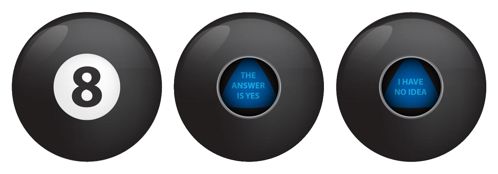

Welcome to the first of the Make School's iOS app tutorials series! This tutorial introduces you to the basics of building iOS apps by building your first app: a Magic 8-Ball!

## What's A Magic 8-Ball?
If you're not familiar with the Magic 8-Ball, it's an 8-Ball with _mysterious_ fortune-telling powers. You can use it by asking simple yes or no questions and shaking the 8-ball for an answer.

For example:

Q: Will _insert your name here_ become an iOS developer?

_shakes 8-ball_

Pretty useful huh? When you're finished with the tutorial, you'll be able to use your new Magic 8-Ball app to make all of life's important decisions!

# Who Is This For?

Beginners (little to no previous iOS experience) who want to get started by building their first iOS app.

## What You Should Already Know

Beginners are expected to have a basic understanding of the Swift programming language. If you haven't been introduced to Swift yet, or even need a refresher, it's recommend to check out Make School's _Getting Started With Swift_ tutorial first.

## Estimated Completion Time:

1 hour

# What We're Building

We'll start our journey into iOS by building a simple Magic 8-Ball app.

You can see the app's flow in the designs above.

1. The user will open the app from our app icon
2. The user is then presented with a prompt to think of a question to ask the Magic 8-Ball
3. Finally, the user can either tap the **Shake** button or rage-shake their phone for an answer.

# What You'll Learn

By the end of this tutorial, you will:

- create a new Xcode project
- add an app icon to your app
- navigate and become familiar with Xcode
- build a really, **really** simple UI
- write code that randomly generates an answer

# Important: Read Me!

Now that I have your attention...

To succeed as an iOS developer and build awesome apps, you'll need to know more than just code. This tutorial will introduce new topics like _getting to know Xcode_ and _creating UI with Interface Builder_, many which don't involve writing code. This might seem irrelevant at first, however you won't be able to build iOS apps without learning about these subjects first.

As you go through the tutorial, pay attention when learning to use Xcode. Xcode will be your bread and butter. The more fluent you are with it, the easier it'll be to build beautiful, well-executed apps.

Most importantly, make sure you're having fun. Building iOS apps is challenging, but also extremely rewarding. There's no feeling like watching your own apps come to life and feeling the pride from knowing you built it yourself!

# If You Get Stuck

"Sometimes, magic is just someone spending more time on something than anyone else might reasonably expect." - Teller (Penn & Teller)

Getting stuck when coding (and debugging) is a natural part of the programming process. If you find yourself stuck on a problem or lost, pause for a moment and take a breath. Maybe take a walk. Then retrace your steps (in the tutorial, not the walk.) Make sure you've follow each step of the tutorial. It's easy to make typos or to accidentally skip over important steps.

If you want to compare your code to the solution, you can find it [here](https://github.com/MakeSchool-Tutorials/Magic-8Ball-Swift4-Solution).
