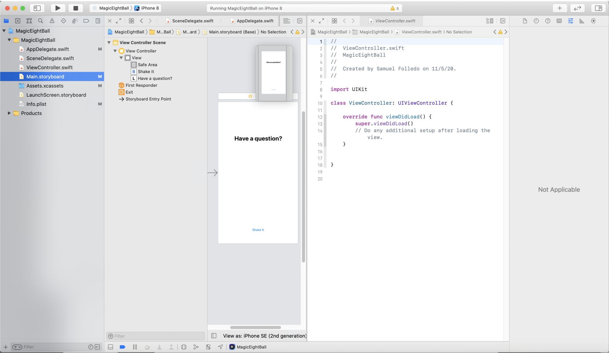
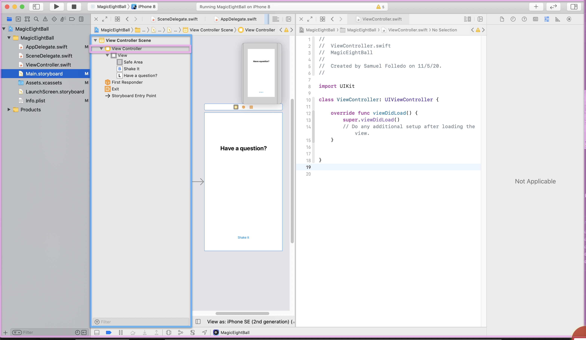
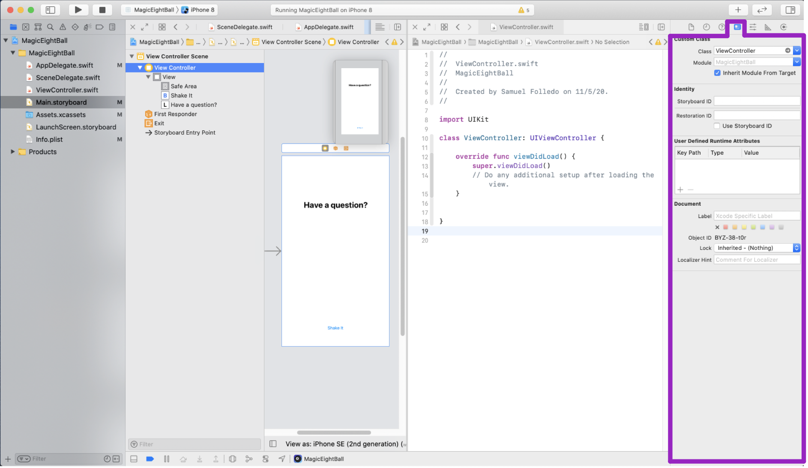
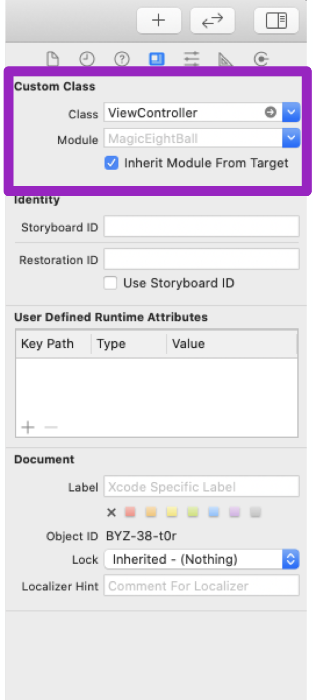
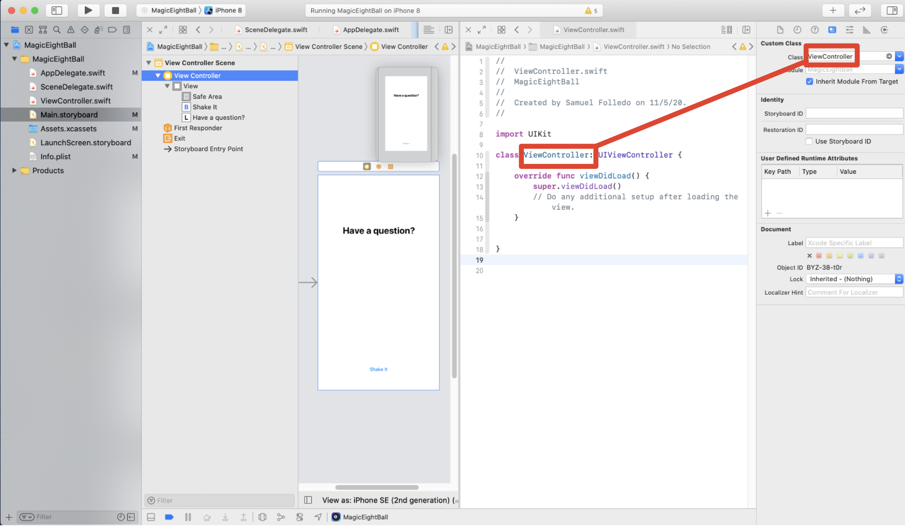
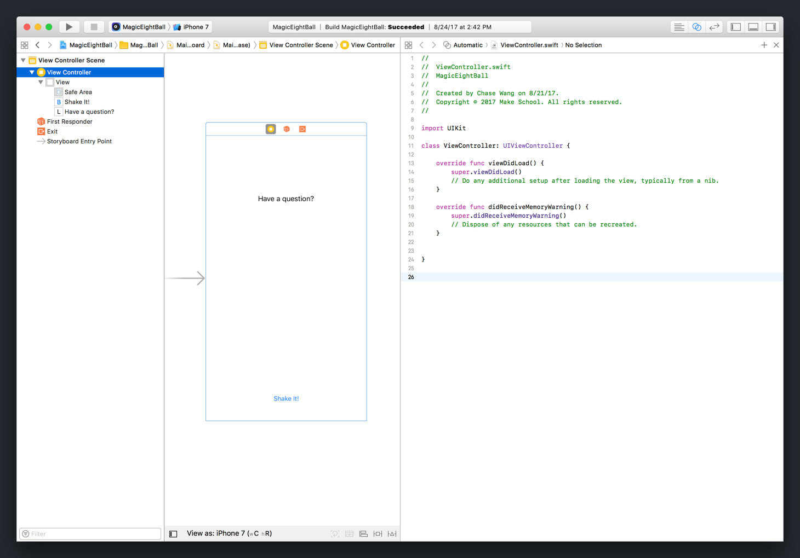
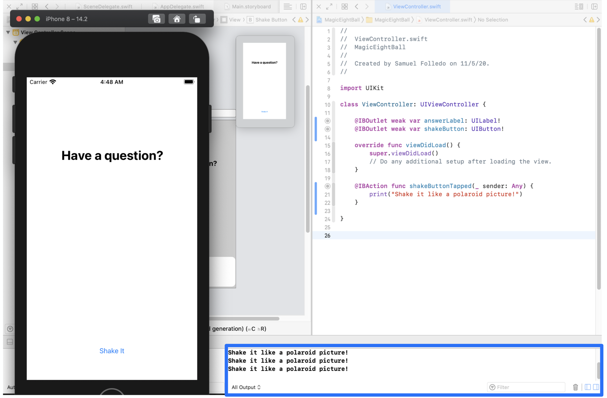
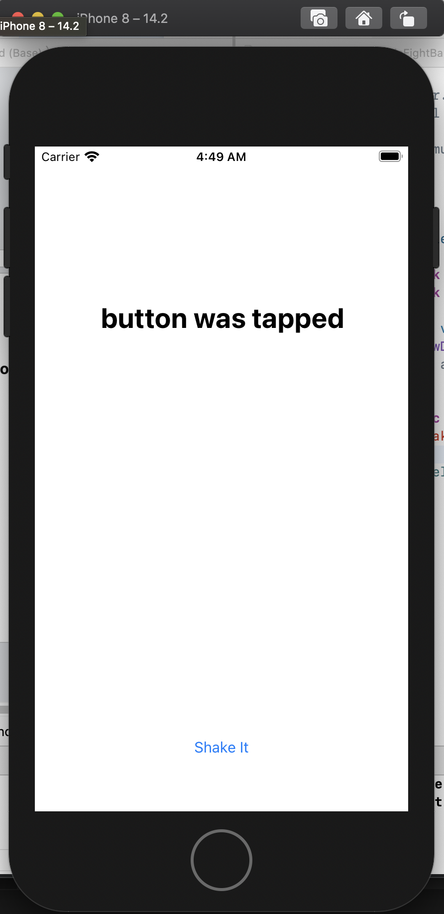
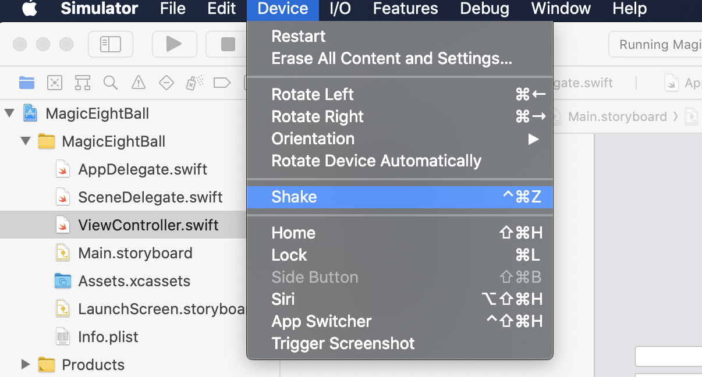

In this section, we'll take a look at how our storyboard connects to code. When you run the app now, you'll notice that when we click _shake button_ in the simulator, nothing happens.

That's because our app won't do anything if we don't write any code. You can think of the code you write as instructions that tell the app what to do when a user is using it. When there aren't any instructions, the app won't do anything.

In the example of responding to a button tap, we'll need to write code to tell the app what to do when a user taps the _shake button_.

# How Is It Connected?

One of the most biggest sticking points for beginners is understanding how your code is connected to storyboard. Xcode connects your storyboard to Swift code by using a combination of the _Identity Inspector_, _IBOutlets_ and _IBActions_.

In order to see this, we'll first need to learn about the _Assistant Editor_.

On the right side of your toolbar, there are two groups of 3 buttons that you can toggle. We'll focus on the first group on the left first.


The three buttons highlighted above allow you to toggle your editor mode. Only one of these modes can be active at a time.

As you can see, the first button, or the _Standard Editor_, is already active. That's because we've already been using the _Standard Editor_ this whole time. The _Standard Editor_ doesn't do anything fancy. It simply gives you a single, large editor window to focus on a single file.

The second button set the editor mode to the _Assistant Editor_. This editor mode is for opening and editing multiple files side-by-side.

> [action]
If you haven't already, toggle the button from the _Standard Editor_ to the _Assistant Editor_. You should see the following:
>


The first thing you might notice, is the lack of screen space for each open file when we use the _Assistant Editor_. We can make this better by hiding unneeded Xcode tools like the _Navigator_. You can do this by using the second group of buttons on the far right-side of the toolbar.


You can use these buttons to toggle between hiding and displaying the _Navigator_, _Debugger_ and _Utilities_ areas. Let's go ahead and close the _Navigator area_ for a little more screen real-estate.

> [action]
Close the _Navigator_ pane by clicking on the first of the buttons. Keep the _Utilities area_ open as we'll need it soon.
>


When working with the _Assistant Editor_, it's often helpful to hide areas of Xcode that we aren't using to free up more screen space.

Now that we know how to display two different files side-by-side, we'll look at how Xcode knows to connect our storyboard view controller to our `ViewController.swift` source file.

# Identity Inspector

> [action]
1. In the _Document Outline_ in your storyboard, select the _View Controller_ storyboard object. 
2. Next, open the _Identity Inspector_ in the _Utilities area_. 

In the _Identity Inspector_, you should see a section that specifies currently selected storyboard view controller's custom class.



Looking at both the `ViewController.swift` file and the _Identity Inspector_, you'll notice that the _Class_ name matches. This is how you can set and define custom behavior for your storyboard object.



> [info]
We don't need to set this up for this project because the _Single View App_ template had this pre-configured for us. For future projects, you'll need to configure each custom view controller's class in the _Identity Inspector_ to connect storyboard view controllers to their respective Swift source file.

# IBOutlets

In our storyboard view controller, we previously added a label and a button. To implement our logic (the instructions for our Magic 8-Ball), we need some way to reference our label and button.

To solve this problem, we'll need to create IBOutlets.

IBOutlets create a connection from our storyboard subview objects (like labels, buttons, image views) to our Swift code. The allow us to reference that we can manipulate programmatically.

> [action]
First to create some more screen space, let's close the _Utilities_ pane using the toolbar. Your Xcode IDE should look like the following:
>


With our `Main.storyboard` and `ViewController.swift` files open side by side, let's create our first IBOutlet.

> [action]
Create an IBOutlet for your answer label.
>
Select the answer label in _Interface Builder_. Next hold down control and drag into your `ViewController.swift` file. 

Repeat the same process for the _shake button_.

> [challenge]
Create a new IBOutlet called `shakeButton` in your `ViewController.swift` file.

<!-- break -->

> [solution]
Select the shake button in _Interface Builder_. Then hold down the control button and drag into your `ViewController.swift` file.
>


We've created both IBOutlets so that we can reference and access our label and button in our `ViewController.swift` file.

Next, we'll look at responding when a user taps the _shake button_ using a IBAction.

# IBAction

An IBAction is a method that is call when the user interacts with a storyboard object. Creating an IBAction is very similar to creating an IBOutlet.

Let's create an IBAction for when a user taps on the _shake button_.

> [action]
Create a IBAction from your _shake button_ in your view controller source file.
>
1. Select the _shake button_.
1. Hold the control button and drag into your view controller source file as if you were to create a IBOutlet.
1. When prompted to name your IBOutlet, change the connection type from `Outlet` to `Action` using the dropdown menu.
1. Name the IBAction, `shakeButtonTapped`.
>


You'll notice it creates a function within your view controller. Whenever the _shake button_ is tapped, this function will be called.

To see this in action, let's print some text in the debug console each time the _shake button_ is tapped.

## Print Debugging

Up to this point, we haven't really discussed or used the debugger. The debugger is an extremely powerful tool that allows us to figure out bugs in our app. In our case, we'll just be printing a simple log to the debug console when a user interacts with our button.

To start, we'll need to add a print statement within our IBAction `shakeButtonTapped`.

> [action]
In your `ViewController.swift`, modify `shakeButtonTapped(_:)` to the following:
>
```
@IBAction func shakeButtonTapped(_ sender: Any) {
    print("shake it like a polaroid picture!")
}
```

Now, let's run the app and try it out.

Once the app launches and you see the UI, click on the _shake button_. In your Xcode debugger, you should see your print statements show up each time you press the shake button!



As you can see, our `shakeButtonTapped(_:)` is called each time the user taps the button.

# Changing Label Text

We've managed to print a log to the console when the button is tapped. Let's take it one step further and change the label text on button tap.

> [action]
In `ViewController.swift`, add the following line of code to `shakeButtonTapped(_:)`:
>
```
@IBAction func shakeButtonTapped(_ sender: Any) {
    print("shake it like a polaroid picture!")
>
    answerLabel.text = "button was tapped"
}
```

Build and run the app again. Tap the _shake button_ and you should see the answer label change to the following text:



Here's what we did:

Each `UILabel` has a text attribute that can be changed and updated. This will also update the UI on the screen. When `shakeButtonTapped(_:)` was called, we set the text property of our label to a new string.

With our new knowledge of handling button interactions and changing the label text, we now can implement our logic of randomly selecting displaying a magic 8 ball answer.

# Implementing Our Logic

We now have all the tools of implementing our Magic 8-Ball. First, let's close the _Assistant Editor_ and return to the _Standard Editor_. Use the _Project navigator_ to display `ViewController.swift` in the _Standard Editor_.

Next, let's implement our logic. First, we'll add an instance variable that is an array of strings containing all possible answers of our Magic 8-Ball. Feel free to add in some of your own!

> [action]
Add the following array of strings above our IBOutlets:
>
```
class ViewController: UIViewController {
>
    // MARK: - Properties
>
    let answers = ["Yes, definitely", "It is certain", "Without a doubt", "Yes", "Most likely", "Sure, why not?", "Same", "Tell me more", "Out to lunch", "Reply hazy, try again", "Ask again later", "The cake is a lie", "42", "TMI", "Very doubtful", "Don't count on it", "My reply is no", "Absolutely not"]
>
    @IBOutlet weak var answerLabel: UILabel!
    @IBOutlet weak var shakeButton: UIButton!
>
    // ... rest of code
}
```

With our new array of answers, we can randomly select an item in our array whenever the shake button is tapped and change the text of the answer label to display it.

> [action]
We can use `arc4random_uniform(_:)` method to randomly choose an answer and implement our Magic 8-Ball logic. Change `shakeButtonTapped` in our view controller to the following:
>
```
@IBAction func shakeButtonTapped(_ sender: UIButton) {
    // 1
    let maxIndex = UInt32(answers.count)
    // 2
    let randomIndex = Int(arc4random_uniform(maxIndex))
>
    // 3
    answerLabel.text = answers[randomIndex]
}
```

Let's break down our code step by step above:

1. We determine the `maxIndex` that will be used to specify the upper bound when we randomly generate an index in our answers array. We have to cast to of type `UInt32` because the method `arc4random_uniform` accepts a argument of type `UInt32`.
1. We use `arc4random_uniform` to randomly generate a index of an answer. We cast it back to of type `Int` because we'll need an integer in order to retrieve the item in our array at the specified index.
1. Last, we set the answer's label text to match the randomly generated answer.

Build and run the app!

Ask the Magic 8-Ball a couple questions and test that it works.

Congrats, we've implemented the basic Magic 8-Ball functionality.

Before we move on, let's take it one step further and implement the shake functionality that comes with a standard Magic 8-Ball.

# Implementing the Shake Gesture

The iPhone by default has implemented certain methods you can override to listen and act on certain events the user takes.

For the shake gesture, we can override a system implemented function and place our own functionality so that the label changes if the user shakes their app.

> [action]
Add the following method to your view controller:
>
```
override func motionEnded(_ motion: UIEventSubtype, with event: UIEvent?) {
    guard motion == .motionShake else { return }
>
    let maxIndex = UInt32(answers.count)
    let randomIndex = Int(arc4random_uniform(maxIndex))
>
    answerLabel.text = answers[randomIndex]
}
```

As you can see, we override the `motionEnded(_:with:)` event and check for the `.motionShake` event. If triggered, we run the logic to randomly select and display an answer.

# Keeping Things DRY

One general rule of thumb for programming is keeping things _DRY_. DRY stands for Don't Repeat Yourself. In other words, you shouldn't be copying and pasting the same code over and over in your codebase.

> [info]
Why do you think copying and pasting your code in multiple places is bad practice?

In our current logic, you can see that we have the same logic for randomly choosing and display an answer twice. We can refactor this to a single method and call this method from both the shake event and button tap instead.

> [action]
In `ViewController.swift` add the following method:
>
```
func generateAnswer() {
    let maxIndex = UInt32(answers.count)
    let randomIndex = Int(arc4random_uniform(maxIndex))
>
    answerLabel.text = answers[randomIndex]
}
```

Next we can refactor our code to use our new `generateAnswer` method:

> [action]
Change both `shakeButtonTapped(_:)` and `motionEnded(_:with:)` to the following respectively:
>
```
@IBAction func shakeButtonTapped(_ sender: Any) {
    generateAnswer()
}
>
override func motionEnded(_ motion: UIEventSubtype, with event: UIEvent?) {
    guard motion == .motionShake else { return }
>
    generateAnswer()
}
```

Run your app and test out your new Magic 8-Ball. Be sure to text both your new shake gesture and the existing button tap logic to see that they work. To test the shake gesture in the iPhone 7 simulator, make sure the simulator is active and select the hardware menu. In the dropdown, you will see an option for `Shake Gesture`.



## Wrapping Up

In this last section, we took the UI we built in storyboard and hooked it up to our code. We looked at the relationship between storyboard and Swift source files and how they communicate on a basic level.

We figured out how to respond to some basic user gestures (button taps and shakes) and finally implemented some logic for our Magic 8-Ball to work.

In the next section, we'll wrap up by reviewing what we learned.
