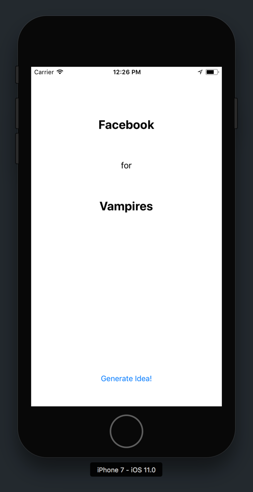

Congrats! You've just built your first iOS app.


You taken your first steps on your journey to become an iOS developer.

In this tutorial, you were introduced to many new concepts in Xcode and iOS development. To recap, you learned how to...

- create new Xcode projects
- use different tools of Xcode
- build simple user interfaces (UI) using _Interface Builder_
- connect storyboard to code with the _Identity Inspector_, IBOutlets and IBActions
- implement app logic for your Magic 8-Ball

Try to remember and visualize what you did for each of these steps in your head.

## Where To Go From Here?

If it went by in a blur, don't worry. You'll need to keep practicing, but eventually these steps will be drilled into your head once you go through the process on your own a few times...

Which leads us to your next challenge!

# A Challenge Approaches

To quote Zig Ziglar, "Repetition is the mother of learning."

To really learn iOS development, we'll have to put the new skills we learned to the test. We'll want to keep repeating and practicing these foundational steps until we know them by memory.

## The Challenge

Coming up with new ideas for apps can be hard. To help out, you're going to creating a startup idea generator. This app will require many of the same skills and concepts you learned during the Magic 8-Ball tutorial.

Try completing this challenge on your own. Refer back to the tutorial only when you get stuck.

## App Design



Here's an example screenshot for the final app. Feel free to get creative and add your style into app design.

## Specs

Similar to the Magic 8-Ball app, you're project will revolve around randomly generated content. This time around, you'll be generating new content for two labels instead of one.

The first label will be set from an array of strings.

Your array will containing the names of existing startups. You can use the array below or generate your own:

```
["Make School", "Uber", "Netflix", "Facebook", "Google", "Kickstarter", "Spotify", "Airbnb", "Snapchat", "YouTube", "Dropbox", "Amazon", "Craigslist", "Tinder", "Instagram", "Tesla", "Twitter", "SpaceX"]
```

The second label will be also set from an array of strings. This time, the array will contain the names of random industries, animals or categories. You can use the array below or generate your own:

```
["Dogs", "Books", "Gamers", "Star Wars", "Bitcoin", "Goats", "Zombies", "Rich People", "Swimmers", "Florida", "Vampires", "Dragons", "Internet of Things", "Mars", "Cryptocurrency", "Mosquito Repellent", "Fidget Spinners", "Sun Screen", "Water Bottles", "Lost Travelers", "Superheroes"]
```

Your app will generate new startup idea whenever the user taps the generate button or shakes the phone.

> [info]
**Pitch That**
>
Another fun way to make use of this app (when you're done) is by practicing your pitching skills with friends. Take turns generating startup ideas with your app and pretend to give a 1 minute pitch to your friends. Your friends can act as investors. At the end of each round, everyone can decide who got funding and who didn't.

Good luck the challenge! Remember, you can look back on the tutorial or your previous code if you get stuck.
